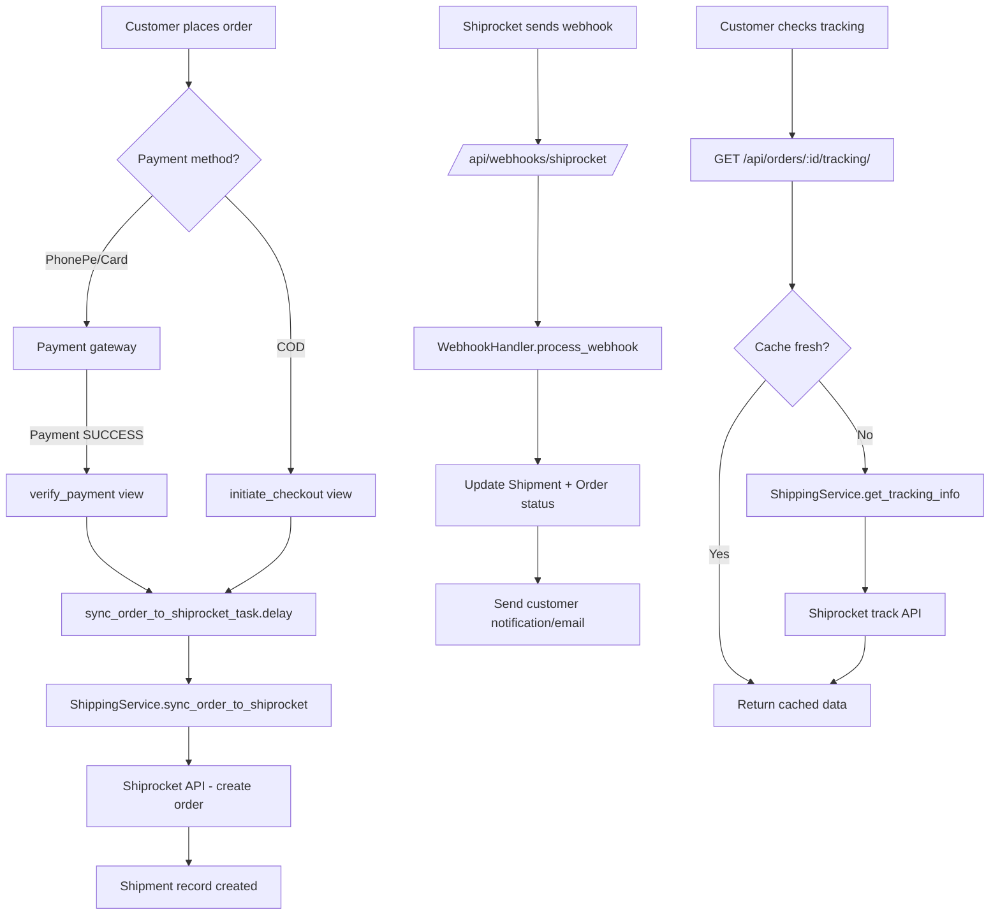

# Design Document: Shiprocket Integration Wiring

## Overview

The Shiprocket integration code is fully implemented. This design covers the minimal changes needed to wire it up end-to-end:

1. Register the Shiprocket webhook in the API router
2. Trigger Shiprocket sync for COD orders at placement
3. Replace the hardcoded ₹50 shipping charge with live Shiprocket rates at checkout
4. Add a tracking API endpoint for customers

No new services, models, or clients need to be created. All changes are in `api/urls.py`, `api/views.py`, and the checkout flow.

---

## Architecture



---

## Components and Interfaces

### 1. Shiprocket Webhook in API Router

Currently `shiprocket_webhook` is only registered in `gift/urls.py` at `/api/webhooks/shiprocket/`. The Next.js frontend and external services use the `/api/` prefix routed through `gift/api/urls.py`. The webhook needs to also be registered there.

Change in `gift/api/urls.py`:
```python
from gift.shipping.webhooks import shiprocket_webhook

# Add to urlpatterns:
path('webhooks/shiprocket/', shiprocket_webhook, name='shiprocket-webhook'),
```

The existing registration in `gift/urls.py` stays as-is (no breaking change).

### 2. COD Order Shiprocket Sync

In `initiate_checkout`, COD orders currently get `payment_method='card'` hardcoded and no Shiprocket sync is triggered. The fix:

- Detect `payment_method` from the request (`cod` vs online)
- For COD: set `payment_status='paid'`, `status='confirmed'`, skip PhonePe, trigger `sync_order_to_shiprocket_task.delay(order.id)`
- For online payment: existing PhonePe flow unchanged

The `CheckoutSerializer` needs a `payment_method` field added.

### 3. Shipping Charge from Shiprocket Rates

In `initiate_checkout`, replace the hardcoded `shipping_charge = 50` with:

```python
shipping_service = ShippingService()
try:
    rates = shipping_service.get_shipping_rates(
        cart=cart_items,
        delivery_pincode=shipping_data['shipping_pincode'],
        cod=(payment_method == 'cod')
    )
    if rates:
        best = shipping_service.calculate_best_rate(rates, courier_id=courier_id)
        shipping_charge = Decimal(str(best['rate']))
        selected_courier_id = best['courier_id']
    else:
        shipping_charge = Decimal('50')  # fallback
except Exception:
    shipping_charge = Decimal('50')  # fallback, log warning
```

The `courier_id` from the request (if the customer pre-selected from the `/api/checkout/shipping-rates/` response) is used to pick the matching rate.

### 4. Order Tracking API Endpoint

New view `get_order_tracking` in `api/views.py`:

```
GET /api/orders/<order_id>/tracking/
```

Response:
```json
{
  "order_id": "ORD12345678",
  "tracking_available": true,
  "awb_code": "1234567890",
  "courier_name": "Delhivery",
  "status": "in_transit",
  "current_status": "In Transit",
  "estimated_delivery_date": "2026-03-18",
  "scans": [
    {"date": "2026-03-15 10:00:00", "activity": "Picked up", "location": "Alwar"}
  ],
  "last_updated": "2026-03-15T12:00:00Z"
}
```

Logic:
- Fetch `Order` by `order_id` for the authenticated user
- If no `shipment` or no `awb_code` → return `tracking_available: false`
- Call `ShippingService.get_tracking_info(shipment)` — this already handles caching (30 min TTL)

---

## Data Models

No model changes required. All necessary fields already exist:
- `Order.courier_id` — stores selected courier
- `Order.payment_method` — used to detect COD
- `Shipment.awb_code`, `tracking_data`, `status` — all present

---

## Error Handling

| Scenario | Behavior |
|---|---|
| Shiprocket rates unavailable at checkout | Fall back to ₹50, log warning, continue |
| COD sync task fails | Log error, order still confirmed, retry via `retry_failed_shipments` periodic task |
| Tracking fetch fails | Return last known `shipment.tracking_data` or `tracking_available: false` |
| Webhook signature invalid | Return 401, log to `WebhookLog` |

---

## Testing Strategy

- Unit test: `initiate_checkout` with `payment_method=cod` — verify order confirmed + task triggered
- Unit test: `initiate_checkout` with Shiprocket rates mocked — verify `shipping_charge` uses rate
- Unit test: `initiate_checkout` with Shiprocket unavailable — verify fallback to ₹50
- Unit test: `get_order_tracking` — with AWB, without AWB, with cached data
- Manual: Place a real COD order on staging and verify shipment appears in Shiprocket dashboard
